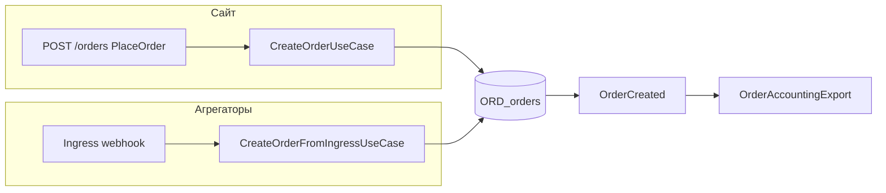

# Документация bounded contexts

Модульная документация по BC проекта Gangsters. Каждый контекст — папка с однотипными файлами.

## Индекс BC

| BC / слой | Обзор | Назначение |
|-----------|-------|------------|
| **Storefront** | [storefront/overview.md](storefront/overview.md) | Bootstrap витрины (composition, не BC) |
| Catalog | [catalog/overview.md](catalog/overview.md) | Каталог товаров |
| **Order** | [order/overview.md](order/overview.md) | Заказ + OrderDraft (сайт) |
| ~~Checkout~~ | [checkout/overview.md](checkout/overview.md) | **Удалён** — см. Order + Storefront |
| **AggregatorIngress** | [aggregator-ingress/overview.md](aggregator-ingress/overview.md) | Приём заказов от агрегаторов |
| **OrderAccountingExport** | [order-accounting-export/overview.md](order-accounting-export/overview.md) | Экспорт заказов в системы учёта |
| Client | [client/overview.md](client/overview.md) | Клиентский аккаунт |
| Delivery | [delivery/overview.md](delivery/overview.md) | Зона и тарифы доставки |
| Promotion | [promotion/overview.md](promotion/overview.md) | Акции и бенефиты |
| MarketingContent | [marketing-content/overview.md](marketing-content/overview.md) | Баннеры, промо-страницы |
| Company | [company/overview.md](company/overview.md) | Юрлица, документы |

## Структура папки BC

| Файл | Содержание |
|------|------------|
| `overview.md` | Роль, границы, пути в коде, аудит |
| `flow.md` | Диаграммы потоков |
| `domain.md` | Агрегаты, VO, порты |
| `application.md` | Use cases, DTO, handlers |
| `infrastructure.md` | БД, мапперы, репозитории |
| `http.md` | API контракты |
| `routing.md` | Маршруты, env, providers |
| `filament.md` | Админка (если есть) |
| `events.md` | Доменные события |

Дополнительно у **AggregatorIngress**: [partners.md](aggregator-ingress/partners.md).

Дополнительно у **OrderAccountingExport**: [systems.md](order-accounting-export/systems.md).

## Создание заказа: два канала

- Сайт: [storefront/flow.md](storefront/flow.md) → [order/flow.md](order/flow.md)
- Агрегаторы: [aggregator-ingress/flow.md](aggregator-ingress/flow.md)
- Экспорт: [order-accounting-export/flow.md](order-accounting-export/flow.md)

## См. также

- [AGENTS.md](../AGENTS.md) — guidance для агентов
- [docs/aggregator-ingress.md](../docs/aggregator-ingress.md)
