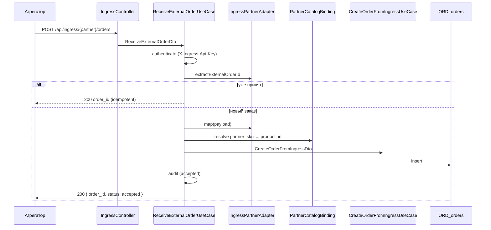

# AggregatorIngress — потоки

## Приём заказа (happy path)



## Идемпотентность

Повтор POST с тем же `(partner_code, external_order_id)`:

- **не** создаёт второй заказ;
- возвращает **200** с тем же `order_id`;
- пишет audit `result = idempotent`.

Ключ извлекается адаптером партнёра (`extractExternalOrderId`), не общим полем JSON.

## Отказ

| Причина | HTTP | Audit |
|---------|------|-------|
| Неверный API-key | 401 | `rejected` |
| Партнёр не настроен / disabled | 404 | — |
| Неизвестный SKU | 422 | `rejected` |
| Невалидный payload | 422 | `rejected` |

## Связь с Order BC

Checkout **не участвует**. Заказ создаётся напрямую:

```
IngressMappedOrder → CreateOrderFromIngressDto → Order::fromIngressSnapshot
```

Поля в `ORD_orders`: `source = aggregator`, `partner_code`, `external_order_id`, `checkout_id = null`.

## Где виден заказ

| Контур | Видимость |
|--------|-----------|
| Filament `/admin/orders` | да, колонка «Источник» + партнёр |
| `GET /api/order` (SPA) | нет (гостевой, без `client_id`) |

См. также [Order flow — создание с сайта](../order/flow.md).
