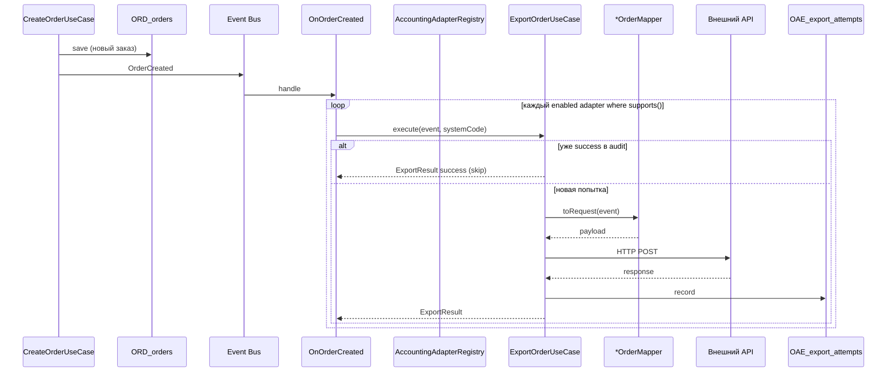

# OrderAccountingExport — потоки

## Экспорт после создания заказа (happy path)



## Триггеры `OrderCreated`

Событие диспатчится **только при первом создании**, не при идемпотентном повторе:

| Канал | Use case | Ключ идемпотентности |
|-------|----------|----------------------|
| Сайт | `CreateOrderUseCase` | `checkout_id` |
| Агрегатор | `CreateOrderFromIngressUseCase` | `partner_code` + `external_order_id` |

См. [Order flow](../order/flow.md).

## Идемпотентность экспорта

Повторная обработка того же заказа в одну систему:

- `ExportAttemptRepository::hasSuccessfulExport(order_id, system_code)` → **не шлём** повторно;
- возвращается `ExportResult::success()` без HTTP-вызова.

Неуспешные попытки можно повторить вручную (перезапуск listener / будущий retry job) — номер попытки растёт через `nextAttemptNumber`.

## Отказ экспорта

| Причина | Поведение |
|---------|-----------|
| Система disabled / не настроена | адаптер не в `enabled()`, пропуск |
| `supports(event) === false` | пропуск |
| Нет product binding | `UnknownAccountingProductException` → audit `failed` |
| HTTP / API error | audit `failed`, заказ в `ORD_orders` **не откатывается** |
| Ошибка одной системы | другие адаптеры продолжают работу |

Экспорт — **отдельный bounded process**. Сбой Frontpad не ломает создание заказа.

## Fan-out

Один `OrderCreated` → N систем учёта параллельно (синхронно в текущей реализации):

```
OrderCreated
  ├─► ExportOrderUseCase(frontpad)  → Frontpad API
  ├─► ExportOrderUseCase(iiko)      → iiko Cloud API
  └─► ExportOrderUseCase(stub)      → no-op (dev)
```

## Данные в payload

Событие несёт полный снимок — мапперам не нужен повторный read из БД:

- `orderId`, `source`, `checkoutId` / `aggregatorReference`
- `cart`, `client`, `delivery`, `payment`
- `occurredAt`

Строки `gift` / `complement` (promotion benefit) **не экспортируются** — как в `payableTotal()`.
