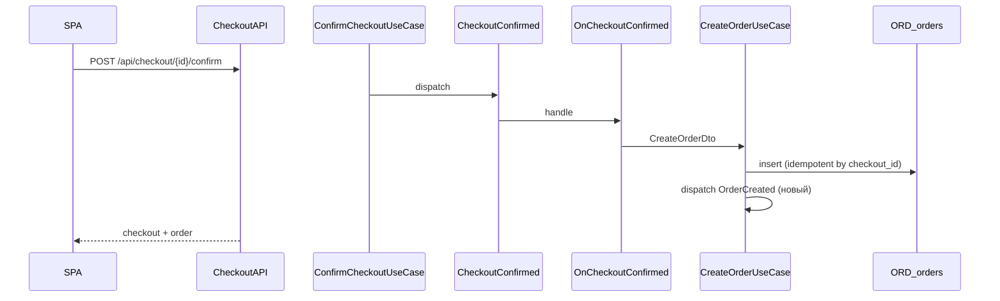
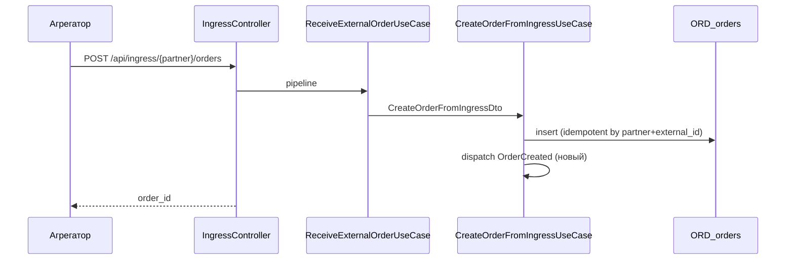
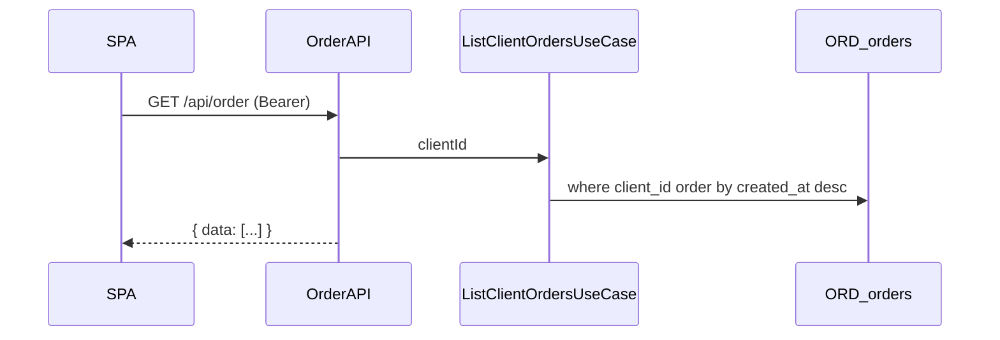

# Order — потоки

## Создание заказа (сайт)

## Создание заказа (агрегатор)

См. [AggregatorIngress flow](../aggregator-ingress/flow.md).

## Экспорт в системы учёта

После `OrderCreated` → [OrderAccountingExport flow](../order-accounting-export/flow.md) (Frontpad, iiko).

## История заказов (SPA)

Триггер загрузки: `useOrdersReadModel({ autoload: true })` в профиле клиента.

## Идемпотентность

| Канал | Ключ |
|-------|------|
| Сайт | `findByCheckoutId` в `CreateOrderUseCase` |
| Агрегатор | `findByPartnerAndExternalOrderId` в `CreateOrderFromIngressUseCase` |

## Гостевые заказы

`client_id` в `ORD_orders` = null → не попадают в `GET /api/order` (только registered).

Оператор видит гостевые заказы в Filament `/admin/orders`.
