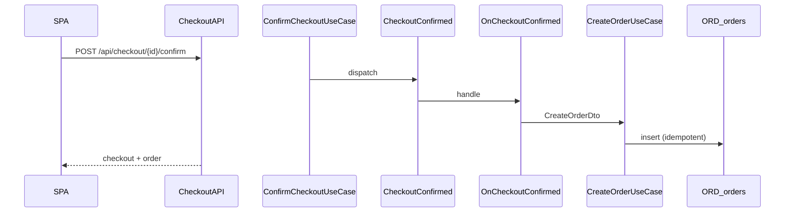
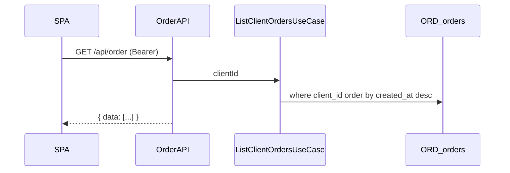

# Order — потоки

## Создание заказа (happy path)

## История заказов (SPA)

Триггер загрузки: `useOrdersReadModel({ autoload: true })` в профиле клиента.

## Идемпотентность

Повторный `confirm` на тот же checkout не создаёт второй заказ — `findByCheckoutId` в `CreateOrderUseCase`.

## Гостевые заказы

`client_id` в `ORD_orders` = null → не попадают в `GET /api/order` (только registered).

Оператор видит гостевые заказы в Filament `/admin/orders`.
