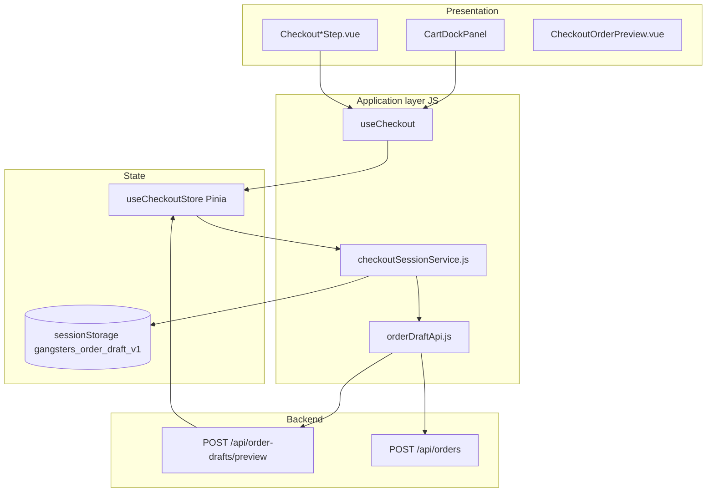

# Order — SPA (корзина и визард оформления)

Клиентская часть site-канала: локальный черновик + stateless preview/place. **Persisted Checkout BC удалён.**

## Архитектура



| Слой | Путь | Роль |
|------|------|------|
| API | `resources/js/api/orderDraftApi.js` | preview, place |
| Сервис | `resources/js/features/checkout/checkoutSessionService.js` | payload, preview, place, bootstrap |
| Storage | `resources/js/features/checkout/checkoutSessionStorage.js` | sessionStorage key + snapshot |
| Store | `resources/js/stores/checkoutStore.js` | единый источник правды корзины и форм |
| Composable | `resources/js/features/checkout/useCheckout.js` | сборка визарда |
| Wizard | `resources/js/features/checkout/useCheckoutWizard.js` | шаги, confirm |
| Steps | `resources/js/features/checkout/useCheckout*Step.js` | guest / delivery / payment |
| UI | `resources/js/components/checkout/` | шаги визарда |
| Dock | `resources/js/components/layout/dock/panels/CartDockPanel.vue` | контейнер визарда |
| Context | `resources/js/composables/checkout/checkoutFlowContext.js` | provide/inject flow |
| Cart commands | `resources/js/features/shoppingSession/useCartCommands.js` | add/remove → checkoutStore |
| Lifecycle | `resources/js/processes/session/useSessionLifecycleProcess.js` | clear после ORDER_CREATED |

**Deprecated aliases (не использовать в новом коде):** `useCheckoutPricingStore`, `useCheckoutFlow`, `useBenefitProgress`.

## Pinia stores

| Store | Участие в checkout |
|-------|-------------------|
| `useCheckoutStore` | корзина, формы, server snapshots, `orderPreview`, `clientRequestId`, `previewRequestSeq` |
| `useUserStore` | auth → `client_id` в preview; logout → clear checkout |
| `useUiStore` | `checkoutWizardStep`, gift modal (in-memory, не в sessionStorage) |
| `useOrderStore` | история после place (`GET /api/order`) |

Отдельного `cartStore` нет.

## sessionStorage

**Ключ:** `gangsters_order_draft_v1`

```json
{
  "clientRequestId": "uuid-v4",
  "localCart": [ { "productId", "qty", "productSnapshot", "pricing", "payload" } ],
  "forms": {
    "deliveryInfo": { "method", "address", "comment", "scheduledAt" },
    "paymentInfo": { "method", "changeFrom" },
    "guestContact": { "name", "phone", "email" },
    "customerComment": "",
    "promotions": { "freeRollGiftProductId": null }
  }
}
```

Системные строки (gift/complement) **не** persist — приходят только из preview API.

## Lifecycle

| Этап | Что происходит |
|------|----------------|
| App mount | `useAppBootstrap()` → `bootstrapCheckoutSession()` — restore из sessionStorage, optional preview |
| Layout mount | `storefrontStore.fetchBootstrap()` — catalog/delivery/promotion (отдельно от draft) |
| Add to cart | `upsertLocalCartLine` → `POST /api/order-drafts/preview` → `applyFromServer` |
| Wizard steps | локальные формы; delivery — debounced preview (`orderDraftPreviewScheduler.js`, 450 ms) |
| Confirm | `POST /api/orders` с тем же телом + обязательные client/delivery/payment |
| Success | `ORDER_CREATED` → `clearAfterCompleted()` + clear sessionStorage |

### Идемпотентность place

`clientRequestId` (UUID) хранится в sessionStorage и уходит как `client_request_id`. Повторный place с тем же id → тот же `Order` на сервере.

### Защита от гонок preview

`checkoutStore.previewRequestSeq` инкрементируется при:
- каждом новом preview-запросе;
- `clearAfterCompleted()`;
- начале `placeOrderOnServer`.

Устаревшие ответы preview **игнорируются** (`applyFromServer` не вызывается).

## Визард

| Шаг | Компонент | Гостевой | Авторизованный |
|-----|-----------|----------|----------------|
| cart | `CheckoutCartStep` | ✓ | ✓ |
| guest | `CheckoutGuestStep` | ✓ | пропуск |
| delivery | `CheckoutDeliveryStep` | форма адреса | `CheckoutAuthAddressSection` |
| payment | `CheckoutPaymentStep` | ✓ | ✓ |
| confirm | `CheckoutConfirmStep` | ✓ | ✓ |
| success | `CheckoutSuccessStep` | ✓ | ✓ |

Orchestration: `useCheckoutWizard.js`. Шаг в UI — `uiStore.checkoutWizardStep` (не persist).

## Preview payload (клиент → сервер)

Сборка: `buildOrderDraftPayload()` в `checkoutSessionService.js`.

| Блок | Источник |
|------|----------|
| `cart.lines` | только user lines (`!isSystem`) |
| `cart.selected_gift_product_id` | `promotions.freeRollGiftProductId` (синхрон с server после preview) |
| `client` | guest contact или `userStore.profile.id` для registered |
| `delivery` | `deliveryInfo` или выбранный адрес клиента (courier) |
| `payment` | только если выбран method |

Координаты адреса: пустые строки и `(0,0)` **не отправляются** — сервер выполнит geocode по street/house.

## Preview response (сервер → клиент)

Нормализация: `normalizeCheckoutCart.js`, `normalizeOrderPreview.js`, `normalizeBenefitsProgress.js`.

Ключевые блоки в `applyFromServer`:

| Поле | Store |
|------|-------|
| `cart` | `cartItems`, totals |
| `client`, `delivery`, `payment` | server snapshots + локальные формы |
| `benefits_progress` | `benefitsProgress` |
| `delivery_pricing` | `deliveryPricing` |
| `wizard` | `suggestedStep`, `wizardCanConfirm` |
| `order_preview` | `orderPreview` (confirm/delivery UI) |

### UI зоны доставки (шаг delivery)

`CheckoutOrderPreview.vue`: во время `flushing` показывается только «Проверяем адрес в зоне доставки…»; статус in/out zone — после ответа preview.

## Подарок

```
GiftSelectionModal → checkoutStore.setPromotionGift(productId) → preview
```

Eligibility и кандидаты — из `order_preview.gift_cta` / `promo_state.gift_promotion`.

## Domain events

| Событие | Обработчик |
|---------|------------|
| `ORDER_CREATED` | `useSessionLifecycleProcess` → clear checkout |
| `CLIENT_LOGGED_OUT` | то же |
| `CART_CHANGED` | dock badges, fly animation |

## Удалено (не искать в коде)

- `resources/js/api/checkoutApi.js`
- `POST/PATCH /api/checkout/*`
- server-side `checkoutId` / `status` draft
- persisted `CHK_checkouts`

## См. также

- [http.md](http.md) — контракт API
- [flow.md](flow.md) — sequence diagram
- [application.md](application.md) — backend pipeline
- [Storefront SPA](../storefront/spa.md) — bootstrap витрины
