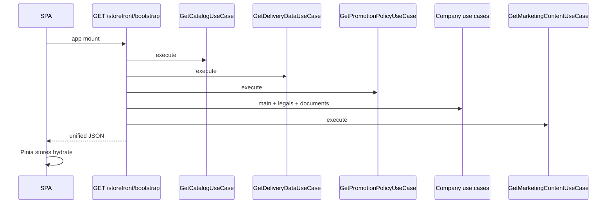

# Storefront — потоки

## Загрузка приложения (SPA)



## Оформление заказа (после bootstrap)

Черновик живёт на клиенте; сервер участвует только в preview и place:

```
local draft (Pinia + sessionStorage)
  → POST /api/order-drafts/preview  (stateless)
  → POST /api/orders                (authoritative)
```

См. [Order flow — сайт](../order/flow.md).

## Разделение read / write

| Контур | Read | Write |
|--------|------|-------|
| Bootstrap | `GET /api/storefront/bootstrap` | — |
| Legacy | `GET /api/catalog`, `/delivery`, … | — |
