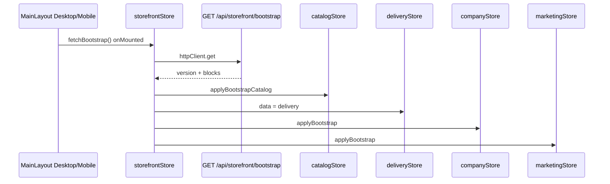

# Storefront — SPA (bootstrap витрины)

Composition read-model на клиенте: один запрос при открытии приложения, раздача по Pinia stores.

## Поток



Параллельно (не часть bootstrap): `useAppBootstrap()` восстанавливает **order draft** из sessionStorage — см. [Order SPA](../order/spa.md).

## Файлы

| Путь | Роль |
|------|------|
| `resources/js/api/orderDraftApi.js` | `fetchStorefrontBootstrap()` |
| `resources/js/api/storefrontApi.js` | re-export bootstrap |
| `resources/js/stores/storefrontStore.js` | оркестрация fetch + hydrate |
| `resources/js/stores/catalogStore.js` | каталог, фильтры (localStorage) |
| `resources/js/stores/deliveryStore.js` | зона и тарифы |
| `resources/js/stores/companyStore.js` | юрлица, документы |
| `resources/js/stores/marketingStore.js` | баннеры, промо-карточки |
| `resources/js/layouts/MainLayoutDesktop.vue` | `fetchBootstrap()` |
| `resources/js/layouts/MainLayoutMobile.vue` | то же |

## `storefrontStore.fetchBootstrap()`

1. `GET /api/storefront/bootstrap`
2. `catalogStore.applyBootstrapCatalog(data.catalog)`
3. `deliveryStore.data = data.delivery`
4. `companyStore.applyBootstrap(data.company)`
5. `marketingStore.applyBootstrap(data.marketing)`
6. `promotion` из ответа доступен как `storefrontStore.promotion` (read-only policy для UI; расчёт benefits — через order draft preview)

Повторный вызов при уже загруженном bootstrap — no-op (`loaded` flag).

## Блоки ответа

См. [http.md](http.md). Кратко:

| Блок | Потребитель SPA |
|------|-----------------|
| `catalog` | Home, ProductCard, модалка товара, cart line payload |
| `delivery` | DeliveryPage, DeliveryDockPanel, карта зоны |
| `promotion` | пороги подарка/доставки (информирование); authoritative расчёт — preview |
| `company` | footer, contacts, legal modals |
| `marketing` | jumbotron, promotions strip |

### `promotion_meta` в catalog item

Из bootstrap catalog (и legacy `GET /api/catalog`):

```json
"promotion_meta": {
  "counts_as_roll": true,
  "gift_candidate": false,
  "complement_set": false
}
```

Используется для UI badges; серверная классификация roll/gift/complement — в OrderDraft pipeline.

## Legacy endpoints

Остаются для совместимости; **витрина** использует bootstrap:

| Legacy | Use case |
|--------|----------|
| `GET /api/catalog` | `GetCatalogUseCase` |
| `GET /api/delivery` | `GetDeliveryDataUseCase` |
| `GET /api/company/*` | Company use cases |
| `GET /api/marketing/*` | MarketingContent |

## localStorage (не bootstrap)

| Ключ | Store |
|------|-------|
| `gangsters_catalog` | фильтры каталога |
| `gangsters_user` | профиль + token |
| `gangsters_ui` | dock, bottom nav |
| `gangsters_favorites` | избранное гостя |

Order draft — **sessionStorage** `gangsters_order_draft_v1` (Order BC, не Storefront).

## См. также

- [overview.md](overview.md)
- [application.md](application.md)
- [Order SPA](../order/spa.md)
